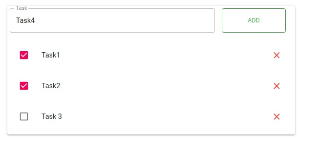

<h1>Тестовое задание FrameWorkTeam (Todo list)</h1>
<h2>Создать форму для CRUD (create, read, update, delete) задач</h2>
<ul>
  <li>Добавление задач через input поле, по клавише “enter” / по кнопке “add”.</li>
  <li>Задача должна иметь возможность быть отмеченной как выполнена (checkbox).</li>
  <li>Любую задачу можно удалить по кнопке справа.</li>
  <li>По клику на задачу, должна появиться возможность редактирования.</li>
  <li>При любом действии, страница не должна перезагружаться.</li>
  <li>Работа с api - json-server.
    <ul>
      <li>Создать объекты api</li>
      <li>Создать .env файл, вынести в него адрес api</li>
      <li>Написать логику получения, создания и обновления тасков с использованием api.</li>
      <li>Подключить axios в проект.</li>
    </ul>
  </li>
  <li>Настроить eslint, добавить eslint airbnb в проект, в проекте не должно быть ошибок eslint.</li>
  <li>Разбить приложение на однофайловые компоненты. Структура примерно следующая:</li>
  <ul>
    <li>app</li>
    <li>list</li>
    <li>task</li>
    <li>layout/container</li>
  </ul>
</ul>

<h2>P.S.</h2>
<ul>
  <li>Для <a href="https://artdemo.github.io/frameworkteam/build/">размещения на GitHub Pages</a> в репозиторий добавлен build и модуль fakeAxios, иммитирующий запросы на сервер.</li>
  <li>Для работы с json-server необходимо разкомментировать импорт axios в api.js.</li>
</ul>